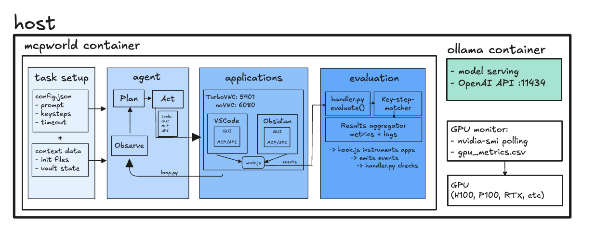

# OpenMCP: a fully open-source and self-hosted testbed for MCP-enabled CUA benchmarking
 

OpenMCP is an open-source benchmarking framework designed for evaluating MCP-enabled **Computer-Using Agents (CUAs)**. It supports agents that interact with software applications via **GUI**, **API (Model Context Protocol – MCP)**, or **Hybrid** methods.


**Table of Contents**  *generated with [DocToc](https://github.com/thlorenz/doctoc)*
<!-- START doctoc generated TOC please keep comment here to allow auto update -->
<!-- DON'T EDIT THIS SECTION, INSTEAD RE-RUN doctoc TO UPDATE -->

- [Key Features](#key-features)
- [Overview](#overview)
- [Prerequisites](#prerequisites)
- [Quickstart](#quickstart)
- [0. Cloning the repo](#0-cloning-the-repo)
- [1. Start the Docker Workspace](#1-start-the-docker-workspace)
  - [What starts automatically:](#what-starts-automatically)
- [2. Install the apps to be tested(Inside `mcpworld` container)](#2-install-the-apps-to-be-testedinside-mcpworld-container)
- [3. Test multiple Ollama automatically (In Host machine)](#3-test-multiple-ollama-automatically-in-host-machine)
- [4. Monitor Headless Runs](#4-monitor-headless-runs)
- [Running Tests](#running-tests)
- [Documentation](#documentation)
- [Project Structure](#project-structure)
- [Quick References](#quick-references)
  - [Environment Variables](#environment-variables)
  - [Task Counts](#task-counts)
  - [Port Mapping](#port-mapping)
- [License](#license)

<!-- END doctoc generated TOC please keep comment here to allow auto update -->

---

## Key Features

* **Host your own model**

* **Bring your own cloud**:

* **Demonstrated Demo Task Suite**: \~30+ tasks across applications (VSCode, Obsidian).

* **GUI, API, and Hybrid Interaction**: Integrated MCP support enables robust mixed-mode control, letting agents fall back to GUI when APIs are unavailable.

* **Black and White-Box Evaluation**

  * Easily expandable evaluators for black-box testing
  * Built-in evaluators inspect internal app signals or outputs for precise, reproducible task verification.

* **Cross-Platform via Docker**: Containerized environments ensure consistent setups on Linux, macOS, and Windows.

* **Extensible Framework**: Easily add new tasks, applications, or custom agents via clear folder structure and interfaces.

---

## Overview


---

## Prerequisites

* Docker
* Nvidia Container Toolkit (For Docker container to access GPU resource)
- For the instance resource setup allocation in ChameleonCloud, please follow [this notebook](https://github.com/AguLeon/MCP_SLM_Project/blob/main/start_run_instance.ipynb) in ChameleonCloud Trovi Experiment

---
## Quickstart

Kick off OpenMCP environment with the essentials below/ Each step explains what the command accomplishes so the system can be run with confidence. These can be done directly after cloning the repository and its sub-modules.

## 0. Cloning the repo
```bash
git clone https://github.com/AguLeon/MCPWorld
cd MCPWorld
git submodule update --init PC-Canary
```

We also want to clone downstream linked repositories to the open-source apps we use (e.g. VS Code):
```bash
git submodule update --init --recursive
```

## 1. Start the Docker Workspace

Bring up the container stack using the entrypoint script. This boots the desktop environment, VNC/noVNC services, Ollama, and prepares the shared workspace volume.

```bash
cd ~/MCPWorld
./scripts/entrypoint.sh <infrastructure_tag>

# Example:
./scripts/entrypoint.sh H100x1
```

The entrypoint script will:
- Start the Docker containers (with GPU support if available)
- Prompt you to install applications
- Optionally run the benchmark suite

**Options:**
- `--rebuild`: Force rebuild of Docker images even if they exist
  ```bash
  ./scripts/entrypoint.sh --rebuild H100x1
  ```

- SUDO password for `mcpworld` environment : `123`

### What starts automatically:
The entrypoint script launches 2 containers; `mcpworld` and `ollama`:
- In `mcpworld` container, following are run automatically:
    - TurboVNC (display `:4`),
    - The noVNC web proxy (port `6080`),
    - Streamlit to demo LLM and agent's action (port 8501)
    - All the packages specified in `computer-use-demo/computer_use_demo/requirements.txt`
- The `ollama` container runs a Ollama server

NOTE:
To go inside the docker container environment, you can write the following command:
```bash
docker exec -it <container-name> /bin/bash
```
This starts a container's bash session.

## 2. Install the apps to be tested(Inside `mcpworld` container)

> **Important:** Applications must be installed as the **root** user inside the container. The framework assumes that applications are installed by root, not the agent user.

To install applications manually, enter the container as root:
```bash
docker exec -it -u root <container-name> /bin/bash
```

Once inside the container as root, run the installation scripts:
- We have installation scripts for apps inside of `./docker/apps_install_scripts/*`
    - Current list: vscode, obsidian
    - Run the script to install the applications: `/workspace/MCPWorld/docker/apps_install_scripts/obsidian.sh`
    - The script will install the app and create a symbolic link for easy app startup

> **Note:** The app installation scripts do not use `sudo` as they are designed to be run as root. Running them as a non-root user will fail.

Alternatively, the `./scripts/entrypoint.sh` script will prompt you to install applications automatically during setup.

## 3. Test multiple Ollama automatically (In Host machine)
- The script to run the test is in `./scripts/run_multi_model_benchmark.sh <app-name> <infrastructure>`
    - E.g. of infrastructure: H100x1, RasberryPi5, CPU32GB, H100x4, etc.
- You can modify the models list all the models to test
```bash
MODELS=(
    ... # Add all the models to test (Must be available in ollama registry!)
)
```
- The model list is in `./scripts/models.cfg`
- Common model targets: `qwen3-vl:8b-instruct`, `qwen3:32b-instruct`, `ministral-3:14b`.
- Modify the configuration of the tests from: `./scripts/config.cfg`. Some the parameters are
    - Temperature
    - Timeout limit
    - LLM API Endpoint
    - Execution mode (api/gui/mixed)

## 4. Monitor Headless Runs
- The evaluator logs everything under the session folder you specify (default `logs_computer_use_eval/`). Tail the live log and inspect the saved metrics afterward:

```bash
# Watch the evaluator log as it streams (replace paths with your session)
tail -f logs_computer_use_eval/<app-name>_runs/<model-name>_<infrastructure>/<task-id>_<task_name>_evaluator/*.log
```

```bash
# After the run finishes, review the computed metrics and events
cat logs_computer_use_eval/<app-name>_runs/<model-name>_<infrastructure>/result_<timestamp>_<model>_<infrastructure>_<task-id>_<task_name>/*.json
```

- `tail -f …_evaluator.log`: Follow real-time output from the evaluator—tool calls, key-step hits, and final TASK_END status.
- `cat result_….json`: Dump the ResultCollector snapshot (success flag, duration, key-step coverage, token/tool stats). Load it into `jq`/Python for deeper analysis.

---

## Running Tests
After the environment, is created, necessary services are created, and the apps to be tested are installed, now is time to run the test!
There are 2 main ways it can be done:
- From the host machine
    - Running multiple tests across LLM models (`./scripts/run_multi_model_benchmark.sh`)
- From the docker container (`mcpworld`)
    - Running multiple tests for single LLM Model (`/workspace/scripts/run_tasks_range.sh`)
```bash
./scripts/run_tasks_range.sh [app-name] [start-task] [end-task]

# E.g. To run a range
./scripts/run_tasks_range.sh [app-name] 1 10  # Will run tasks 1 to 10 for [app-test]

# E.g. To just run one task
./scripts/run_tasks_range.sh [app-name] 2 2  # Will only run task 2 from [app-name] test tasks

```


<!-- - Running individual tests for single LLM models -->
<!--     ```bash -->
<!--     python3 computer-use-demo/run_pure_computer_use_with_eval.py \ -->
<!--     --provider "$PROVIDER" \ -->
<!--     --openai_api_key dummy \ -->
<!--     --openai_base_url "$OPENAI_BASE_URL" \ -->
<!--     --openai_endpoint "$OPENAI_ENDPOINT" \ -->
<!--     --model "$MODEL" \ -->
<!--     --task_id "$TASK_ID" \ -->
<!--     --log_dir "$RUN_LOG_DIR" \ -->
<!--     --exec_mode "$EXEC_MODE" \ -->
<!--     --timeout "$TASK_TIMEOUT" \ -->
<!--     --api_key "$ANTHROPIC_API_KEY" -->
<!--     ``` -->
<!-- - You can use the batch tests to run the entire benchmark suite while the individual tests is useful for debugging and testing various aspect of this project -->

---

## Documentation

* **Framework Overview**: Please refer to the [framework overview](./framework.md)
* **Test Runner**: Please refer to the [test scripts details](./scripts/README.md)
* **Onboaring New Applications and Test**: Please refer to the [onboading guide](./onboard-application.md)

---

## Project Structure
```
MCPWorld/
├── computer-use-demo/           # Agent implementation
│   ├── computer_use_demo/
│   │   ├── loop.py              # Main sampling loop
│   │   ├── providers/           # LLM provider adapters
│   │   ├── tools/               # Computer use tools
│   │   ├── mcpclient.py         # MCP client
│   │   └── streamlit.py         # UI
│   ├── image/                   # Docker image assets & startup scripts
│   ├── tests/                   # Unit tests
│   └── run_pure_computer_use_with_eval.py  # Headless runner
├── PC-Canary/                   # Evaluation framework (submodule)
│   ├── evaluator/
│   │   ├── core/
│   │   │   ├── base_evaluator.py
│   │   │   ├── result_collector.py
│   │   │   └── metrics/
│   │   └── utils/
│   ├── tests/
│   │   ├── tasks/               # Task definitions (vscode: 25, obsidian: 12)
│   │   └── context_data/        # Pre-configured app states
│   └── apps/                    # Application source repositories
├── docker/                      # Container configuration
│   ├── docker-compose.yml       # Multi-container setup (mcpworld + ollama)
│   ├── Dockerfile
│   ├── start_service.sh
│   └── apps_install_scripts/    # App installation scripts
├── scripts/                     # Batch execution & metrics collection
    ├── entrypoint.sh            # Main entry point for OpenMCP setup
    ├── config.cfg               # Batch run configuration
    ├── models.cfg               # Models to benchmark
    ├── run_tasks_range.sh       # Generic task range runner
    ├── run_vscode_range.sh      # VSCode batch runner
    ├── run_obsidian_range.sh    # Obsidian batch runner
    ├── run_vscode_then_obsidian_range.sh  # Sequential runner
    ├── run_multi_model_benchmark.sh       # Multi-model automation
    ├── monitor_gpu.py           # GPU metrics monitoring
    ├── kill_all_benchmarks.sh   # Cleanup utility
    └── collect_metrics.py       # Results aggregation utility
```


---

## Quick References
### Environment Variables

| Variable            | Description                     | Default                              |
|---------------------|---------------------------------|--------------------------------------|
| ANTHROPIC_API_KEY   | Anthropic API key               | dummy_api_key                        |
| OPENAI_BASE_URL     | OpenAI-compatible endpoint      | http://host.docker.internal:11434    |
| OPENAI_ENDPOINT     | API endpoint path               | /v1/chat/completions                 |
| OPENAI_TIMEOUT      | Request timeout                 | 1000                                 |
| WIDTH               | Screen width                    | 1000                                 |
| HEIGHT              | Screen height                   | 1000                                 |
| OLLAMA_KEEP_ALIVE   | Model keep-alive duration       | 24h                                  |
| LLM_TEMPERATURE     | Model temperature               | 0.7                                  |


### Task Counts
| Application | Task Count      |
|------------|-----------------|
| VSCode     | 25 tasks        |
| Obsidian   | 12 tasks        |
| Telegram   | Multiple tasks  |

### Port Mapping
| Port  | Service                 |
|-------|--------------------------|
| 5900  | VNC Server (legacy)      |
| 5904  | VNC Server (active)      |
| 6080  | noVNC Web Proxy          |
| 8501  | Streamlit UI             |
| 11434 | Ollama API               |

---

<!-- ## 📖 Citation

```bibtex
@inproceedings{MCPWorld2025,
  title     = {MCPWorld: A Multi-Modal Test Platform for Computer-Using Agents},
  author    = {YourName and Author1 and Author2},
  booktitle = {NeurIPS 2025},
  year      = {2025}
}
``` -->

<!-- --- -->

## License

Released under the MIT License.

